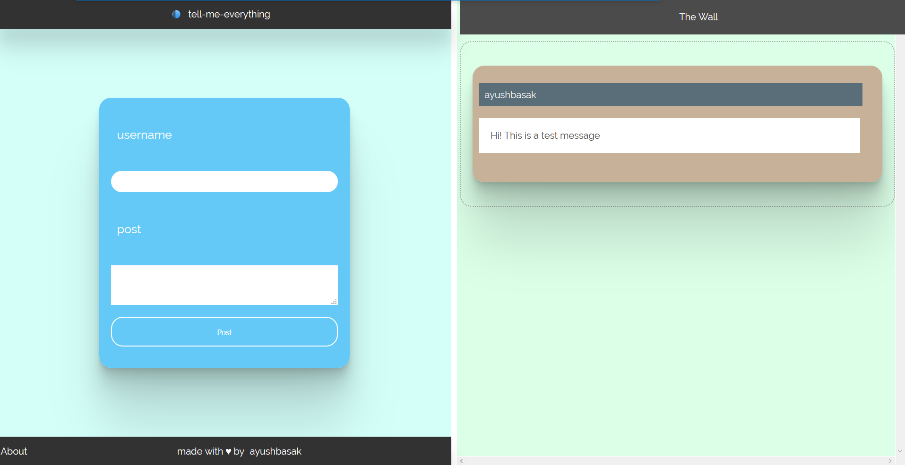

# tell-me-everything 
#### v1.0  
##### 3 Septempter 2020  

---  
A very simple flask app for anonymous users to post on **The Wall**. It is currently deployed on heroku and uses sqlite as the database. (Upgrading to PostgreSQL soon.). Users can choose any random username ans speak whatever they have on their mind.  
  
This app currently does not have any WebSocket protocol, so one has to reload the webpage to see any new content. Since *Heroku* restarts its dynos ever so often, the app is refreshed and the database is cleared. Hence, SQLite is not a good choice for deployment.

---
  
### Usage on local machine:  

- Clone the repository
- Install the contents of **requirements.txt**
- Run `py flask-app.py`

Server will be hosted on **localhost:5000** 

### Site:
[Here](https://tellmeeverythingflask.herokuapp.com)
